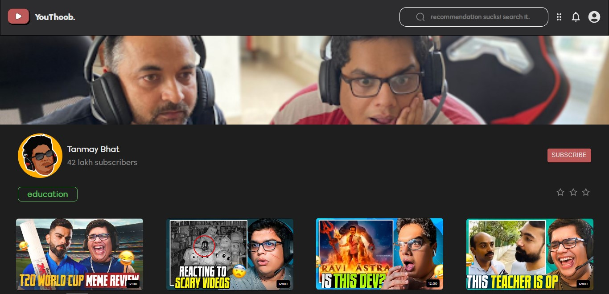

<div id="top"></div>

<div align="center">
  <!-- logo -->

  
  <!-- title -->
  <h2><b>Youthoob</b></h2>
  <!-- tagline -->
  <p>A clone of youtube</p>

  <p  align="center">
    <!-- CTA -->
    ·
    <a href="https://whischat.vercel.app/">View Demo</a>
    ·
  </p>
</div>
<hr>

### **Decription**

<p>Youtube is a clone of youtube but with great user-experience and user-interface.<br/>
Youthoob make sure to keep away you from the gibberish & ads.
<br/>
*this project is still in production.
</p>

<hr>

### **Stack**

 <table>
     <tbody>
  <tr>
   <td align="Center" width="30%"> 
<a href="https://www.w3.org/html/" target="_blank" rel="noreferrer" title="HTML5">  </a>
<br>HTML
    </td>   
   
   <td align="Center" width="30%">
        <a href="https://developer.mozilla.org/en-US/docs/Web/JavaScript" target="_blank" rel="noreferrer"></a>
    <br>JavaScript
    </td> 
  <td align="Center" width="30%">
 <a href="https://www.w3schools.com/css/" target="_blank" rel="noreferrer" title="CSS3">  </a> 
    <br>CSS
    </td>   
    <td align="Center" width="30%">  
<a href="https://www.mongodb.com/" target="_blank" rel="noreferrer"></a>
    <br>MongoDB
    </td>     
      </tr>
</tbody>
  </table>

  <table>
   <tbody>
      <tr>
     <td align="Center" width="30%">   
 <a href="https://reactjs.org/" target="_blank" rel="noreferrer"></a>
    <br>React
    </td>  
  <td align="Center" width="30%">      
<a href="https://tailwindcss.com/" target="_blank" rel="noreferrer"></a> 
  <br>Tailwind CSS
    </td>
    <td align="Center" width="30%">      
<a href="https://mui.com/" rel="noopener" target="_blank"></a>
  <br>Material UI
    </td>
    <td align="Center" width="30%">      
<a href="https://rapidapi.com/" target="_blank" rel="noreferrer"></a> 
  <br>Rapid API
    </td>
          </tr>
</tbody>
  </table>

<hr>

### **Features**

- fully responsive for alomst every width devices.
  > [320px to 2000px]
- search bar functionality to find relevent videos and channel.
- almost have every functionality as same as youtube.
  - searching for videos and channels.
  - can create, edit, delete playlist, etc.
- but, what makes youthoob different?
  - algorithm based suggested videos.
  - catergory based content filtering.
  - have a rating algorithm to every video and channel to find which one is worth wathing.
  - caterory tag on videos.
  - also, dislike count on videos.
- Animated & minimal UI.
- Great user-experience.
- use axios mehtod to fetch data from rapid api.

<hr>

### **Overview**

|                                                        Desktop                                                         |                                                          Mobile                                                           |
| :--------------------------------------------------------------------------------------------------------------------: | :-----------------------------------------------------------------------------------------------------------------------: |
|  |   |
|  |  |
|   |  |
|  |   |

<hr>

### **Getting Started**

To get a local copy up and running follow these simple steps.

#### 👇🏽 **Prerequisites**

Before installation, please make sure you have already installed the following tools:

- [Git](https://git-scm.com/downloads)
- [NodeJs](https://nodejs.org/en/download/)

#### 🛠️ **Installation**

1. Fork the project. Click on the fork icon in the top right to get started
2. Clone the project, you can use the following command:

   ```bash
   git clone https://github.com/<your-github-username>/<project-name>
   ```

3. Navigate to the project directory

   ```bash
   cd <project-name>
   ```

4. Install dependencies with `npm install`

   ```bash
   npm install
   ```

5. Run npm start in project root directory

   ```bash
   npm run start
   ```

<p align="right">(<a href="#top">back to top</a>)</p>

<hr>

### **Support**

This project needs a star️ from you. Don't forget to leave a star🌟

<p align="right">(<a href="#top">back to top</a>)</p>
